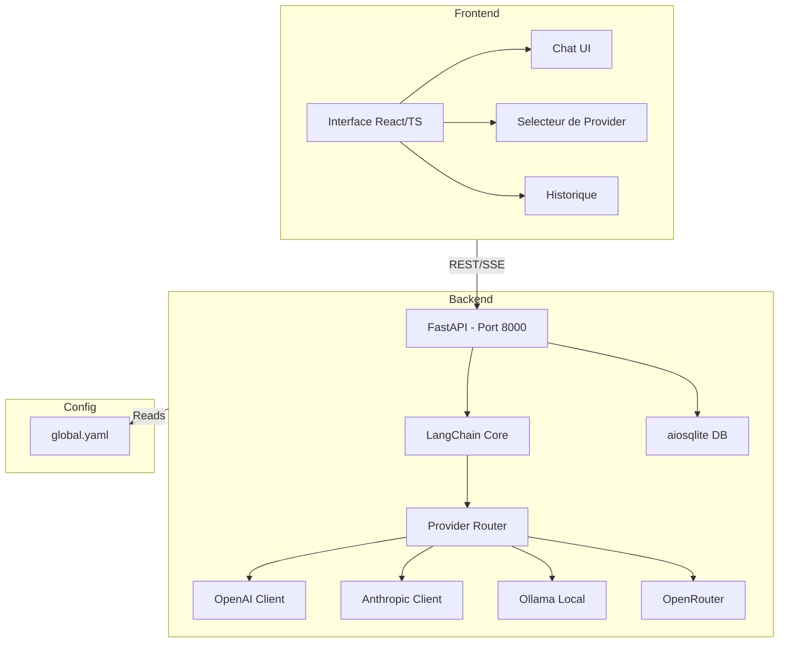

# DagBot

> **Assistant IA conversationnel multi-providers avec interface web moderne**
> Connectez-vous a n'importe quel LLM (OpenAI, Anthropic, Mistral, Ollama, Hugging Face...) via une interface unifiee, configurable et deployable en un clic.

[](https://www.typescriptlang.org/)
[](https://www.python.org/)
[](https://fastapi.tiangolo.com/)
[](https://langchain.com/)
[](LICENSE)

---

## Table des matieres

- [Presentation](#presentation)
- [Fonctionnalites](#fonctionnalites)
- [Providers LLM supportes](#providers-llm-supportes)
- [Architecture](#architecture)
- [Stack technique](#stack-technique)
- [Structure du projet](#structure-du-projet)
- [Installation](#installation)
- [Configuration](#configuration)
- [Utilisation](#utilisation)
- [Roadmap](#roadmap)
- [Contribution](#contribution)
- [Licence](#licence)

---

## Presentation

**DagBot** est un assistant IA conversationnel full-stack qui abstrait la complexite des differents fournisseurs de LLMs derriere une interface unique et unifiee. L'utilisateur peut basculer en temps reel entre OpenAI, Anthropic, Mistral, Ollama (local), Hugging Face, LM Studio, vLLM et bien d'autres, sans changer de code.

Concu avec une architecture propre (`.agent`, `Code/Backend`, `Code/Frontend`, `Config/`), DagBot est pensé pour les developpeurs et chercheurs IA qui souhaitent comparer les modeles, tester des prompts et construire des workflows conversationnels avances avec LangChain.

---

## Fonctionnalites

- **Multi-providers** : Switch entre 8+ providers LLM via un seul fichier YAML
- **Interface web moderne** : Frontend React/TypeScript avec Tailwind CSS
- **Backend async** : API FastAPI haute performance avec streaming SSE
- **Agents IA** : Orchestration de workflows avec LangChain Core
- **Configuration YAML** : Centralisation de tous les parametres dans `Config/global.yaml`
- **Base de donnees locale** : Persistance des conversations avec aiosqlite
- **Modeles locaux** : Support Ollama et LM Studio pour fonctionnement hors-ligne
- **Historique des conversations** : Stockage et reprise des sessions
- **Streaming** : Reponses en temps reel avec Server-Sent Events
- **Skills et workflows** : Architecture extensible via `.agent/skills/` et `.agent/workflows/`

---

## Providers LLM supportes

| Provider | Modeles par defaut | Acces |
|---|---|---|
| **OpenAI** | gpt-4o, gpt-4o-mini, gpt-3.5-turbo | API Cloud |
| **OpenRouter** | Gemini, Llama 3, Claude, Mistral... | API Cloud (agregateur) |
| **Anthropic** | claude-3-opus, claude-3-sonnet, claude-3-haiku | API Cloud |
| **Mistral AI** | mistral-large, mistral-small, mixtral-8x22b | API Cloud |
| **Ollama** | llama3, llama2, mistral, gemma | Local |
| **Hugging Face** | Llama-3-8B, Mistral-7B, Gemma-2b | API Cloud |
| **LM Studio** | Tout modele GGUF | Local (GUI) |
| **vLLM** | Tout modele compatible | Local (prod) |
| **Generic API** | Custom endpoint OpenAI-compatible | Configurable |

---

## Architecture



---

## Stack technique

### Backend (Python)

| Technologie | Version | Role |
|---|---|---|
| FastAPI | 0.115 | Framework API REST + SSE |
| Uvicorn | 0.34 | Serveur ASGI |
| LangChain Core | 0.3 | Orchestration des LLMs |
| LangChain OpenAI | 0.3 | Intégration OpenAI/compatible |
| Pydantic | 2.10 | Validation des schemas |
| aiosqlite | 0.20 | Base de donnees async |
| httpx | 0.27 | Client HTTP async |
| pyyaml | 6.0 | Lecture de la config YAML |
| python-dotenv | 1.0 | Variables d'environnement |

### Frontend (TypeScript/React)

| Technologie | Role |
|---|---|
| React + TypeScript | Framework UI |
| Vite | Dev server et bundler |
| Tailwind CSS | Styling utilitaire |
| Firebase | Hebergement et authentification |

---

## Structure du projet

```
DagBot/
|-- .agent/                    # Agents IA
|   |-- skills/                # Competences des agents
|   |-- workflows/             # Workflows d'orchestration
|
|-- .gemini/                   # Config Google Gemini
|
|-- Code/                      # Code source principal
|   |-- Backend/
|   |   |-- app/               # Application FastAPI
|   |   |-- requirements.txt
|   |-- Frontend/              # Application React/TypeScript
|
|-- Config/
|   |-- global.yaml            # Configuration globale (providers, modeles, ports)
|
|-- Log/                       # Journaux d'execution
|-- dagbot.db                  # Base de donnees SQLite locale
|-- firebase-debug.log         # Logs Firebase
```

---

## Installation

### Prerequis

- Python >= 3.9
- Node.js >= 18
- Au moins une cle API LLM (OpenAI, Anthropic, OpenRouter...) ou Ollama en local

### 1. Cloner le depot

```bash
git clone https://github.com/dagornc/DagBot.git
cd DagBot
```

### 2. Configurer les variables d'environnement

```bash
cp .env.example .env
# Editer .env
```

### 3. Installer le backend

```bash
cd Code/Backend
python -m venv .venv
source .venv/bin/activate  # Windows: .venv\Scripts\activate
pip install -r requirements.txt
```

### 4. Installer le frontend

```bash
cd Code/Frontend
npm install
```

### 5. Lancer l'application

```bash
# Terminal 1 - Backend
cd Code/Backend && uvicorn app.main:app --reload --port 8000

# Terminal 2 - Frontend
cd Code/Frontend && npm run dev
```

L'interface est disponible sur `http://localhost:5173`.

---

## Configuration

Toute la configuration des providers est centralisee dans `Config/global.yaml` :

```yaml
app:
  name: "DagBot"
  version: "1.0.0"
  backend_port: 8000
  frontend_port: 5173

llm_providers:
  openai:
    api_key: "${OPENAI_API_KEY}"
    default_model: "gpt-4o-mini"
    models: ["gpt-4o", "gpt-4o-mini", "gpt-3.5-turbo"]
    recommended: true

  openrouter:
    api_key: "${OPENROUTER_API_KEY}"
    base_url: "https://openrouter.ai/api/v1"
    default_model: "google/gemini-2.0-flash-exp:free"
    recommended: true

  ollama:
    base_url: "http://127.0.0.1:11434/v1"
    default_model: "llama3"
    # Aucune cle API requise
```

Variables d'environnement requises (fichier `.env`) :

```env
OPENAI_API_KEY=sk-...
OPENROUTER_API_KEY=sk-or-...
ANTHROPIC_API_KEY=sk-ant-...
HUGGINGFACE_API_KEY=hf_...
# Les autres providers (Ollama, LM Studio, vLLM) ne necessitent pas de cle
```

---

## Utilisation

### Demarrer une conversation

1. Ouvrir `http://localhost:5173`
2. Selectionner un provider LLM dans le menu deroulant
3. Choisir le modele souhaite
4. Taper votre message et appuyer sur Entree
5. La reponse arrive en streaming en temps reel

### Basculer entre providers

Modifiez simplement le provider dans l'interface - la conversation continue avec le nouveau modele. Aucune configuration supplementaire n'est necessaire si les cles API sont dans `.env`.

### Utiliser Ollama (local)

```bash
# Installer Ollama
curl -fsSL https://ollama.ai/install.sh | sh

# Telecharger un modele
ollama pull llama3

# DagBot detecte automatiquement Ollama sur http://127.0.0.1:11434
```

---

## Roadmap

- [x] Multi-providers (OpenAI, Anthropic, Mistral, Ollama, HF, vLLM)
- [x] Backend FastAPI avec streaming SSE
- [x] Configuration YAML centralisee
- [x] Persistance des conversations (SQLite)
- [x] Architecture agents avec skills et workflows
- [ ] Interface de gestion des conversations (recherche, suppression)
- [ ] Partage de conversations par lien
- [ ] Support des fichiers joints (images, PDF - vision)
- [ ] Mode comparaison : reponse simultanee de plusieurs modeles
- [ ] Plugin system pour skills personnalisees
- [ ] Deploiement Docker Compose
- [ ] Interface d'administration des cles API

---

## Contribution

1. Forker le depot
2. Creer une branche : `git checkout -b feature/nouvelle-fonctionnalite`
3. Committer : `git commit -m 'feat: ajouter nouvelle fonctionnalite'`
4. Pousser : `git push origin feature/nouvelle-fonctionnalite`
5. Ouvrir une Pull Request

---

## Licence

Ce projet est sous licence **MIT**.

---

> Construit avec passion par [dagornc](https://github.com/dagornc) - Developpeur IA en Bretagne.
